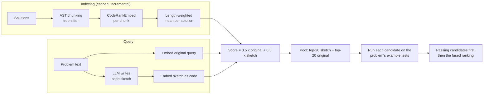

# Agentic Code Retrieval

Retrieval pipeline for the **CoIR AppsRetrieval** task: given a programming problem in natural language, rank ~8,800 Python solutions so the correct one comes first.

The pipeline improves a strong code embedding model (CodeRankEmbed) with three steps from the problem statement's suggested directions:

1. **Document pre-processing:** every solution is split into AST chunks with tree-sitter (cAST split-then-merge), and the chunk vectors are pooled into one vector per solution.
2. **Query pre-processing:** an LLM (Gemini or OpenAI) reads the problem and writes a short **code sketch**. Searching with code instead of the story closes the text-to-code gap, which was the main cause of failures.
3. **Second retrieval pass (review):** the top candidates from the sketch search and the original query are **run on the example tests** in the problem statement. Candidates that print the expected output move to the top.

## Results

**Full AppsRetrieval test split (3,765 queries), via MTEB:**

| Configuration | nDCG@10 | MRR@10 |
|---|---|---|
| CodeRankEmbed, whole documents | 0.2345 | 0.2050 |
| CodeRankEmbed + AST chunking | 0.2332 | 0.2040 |
| **Full pipeline (this repo)** | _fill in after `python run_mteb.py`_ | |

**Development sample (329 test queries, stratified: one third each of easy / medium / hard queries for the baseline, so not comparable to the table above):**

| Step | nDCG@10 | R@1 | Median rank of correct solution |
|---|---|---|---|
| Original query | 0.218 | 0.146 | 42 |
| LLM code sketch | 0.501 | 0.392 | 3 |
| Sketch + original query | 0.543 | 0.450 | 2 |
| **+ review (run the examples)** | **0.683** | **0.653** | **1** |

How the review behaves on that sample: the correct solution passes its own examples for 81% of problems, it is in the reviewed pool for 72% of queries, and a wrong candidate passes the examples for 10% of queries.

The experiments behind these numbers are in [`notebooks/`](notebooks).

## How it works



- **Why chunk + pool?** Keeps function boundaries intact and makes re-indexing incremental (see *Versions* below). On APPS, whose solutions are short, it gives about the same accuracy as whole documents.
- **Why a code sketch?** Failure analysis showed the correct solution was usually scored low, not crowded out: the model matched shared words, not meaning. Code-to-code search fixes most of that.
- **Why run the examples?** The first two steps bring the correct solution into the top candidates; running the examples picks it out of them. It costs no API calls.

## Setup

Requires **Python 3.10+**. Works on CPU; a GPU only makes embedding faster.

```bash
git clone <this-repo>
cd agentic-code-retrieval
python -m venv .venv
source .venv/bin/activate          # Windows: .venv\Scripts\activate
pip install -r requirements.txt

cp .env.example .env               # Windows: copy .env.example .env
# then open .env and set GEMINI_API_KEY (or LLM_PROVIDER=openai and OPENAI_API_KEY)
```

`transformers` is pinned below 5.12 on purpose: CodeRankEmbed's model code uses a function that was removed in 5.12.

## Reproduce the submission file

```bash
python run_mteb.py
```

This runs the full pipeline on the AppsRetrieval test split through MTEB and writes **`appsretrieval_results.json`** (the file to upload to the GitHub release). It prints nDCG@10, MRR@10, LLM token usage and timings.

| Command | What it runs |
|---|---|
| `python run_mteb.py` | Full pipeline: chunking + sketch + review (MTEB search interface) |
| `python run_mteb.py --mode encoder` | Template-compatible `PrePostPipelineEncoder(AbsEncoder)`: chunking + sketch, no review |
| `python run_mteb.py --no-review` | Chunking + sketch through the search interface |
| `python run_mteb.py --no-llm --no-review` | Embedding-only baseline |
| `python run_mteb.py --provider openai` | Use OpenAI instead of Gemini |
| `python run_mteb.py --no-chunking` | Whole documents instead of AST chunks |

**Runtime of the first full run:** embedding the corpus (~12,600 chunks) and the 3,765 queries is the slow part on CPU; the LLM makes one call per query (parallel); the review runs up to ~40 short programs per query (about 4-5 seconds per query on a 2-core Colab machine). Everything is cached in `.cache/`, so re-runs only redo what changed.

## Demo: search with one query

```bash
python search.py --qid q6609                          # a query from the test split (shows the correct answer's rank)
python search.py --text-file my_problem.txt           # your own problem statement
python search.py --text "count pairs whose sum is divisible by k" --no-review
```

The output shows the LLM's interpretation and sketch, the top-ranked solutions with their code, which ones passed the examples, and a timing breakdown (LLM, embedding, search, review).

## Versions of a codebase (P1)

All work is cached by **content hash**, not by position or ID:

| Cache | Key | Effect when a new version arrives |
|---|---|---|
| Embeddings (`.cache/embeddings/`) | hash of each chunk's text | only new or changed chunks are embedded |
| LLM answers (`.cache/llm/`) | hash of the query text | a query is sent to the API once |
| Review verdicts (`.cache/review/`) | hash of (code, examples) | a program is run once per example set |

Because chunks follow the syntax tree, editing one function changes only that function's chunk, so a new version usually re-embeds a small fraction of the code. To index and search another version, give it as a JSONL file with one `{"id": ..., "text": ...}` per line:

```bash
python search.py --corpus my_code_v2.jsonl --text "..."
```

The script prints how many embeddings were new and how many came from the cache.

## Configuration

Set in `.env` (see `.env.example`):

| Variable | Default | Meaning |
|---|---|---|
| `LLM_PROVIDER` | `gemini` | `gemini` or `openai` |
| `GEMINI_API_KEY`, `GEMINI_MODEL` | `gemini-3.8-flash` | Gemini settings |
| `OPENAI_API_KEY`, `OPENAI_MODEL` | `gpt-5-mini` | OpenAI settings |
| `OPENAI_REASONING_EFFORT` | `minimal` | lower = cheaper and faster |
| `LLM_WORKERS` | `8` | parallel LLM calls |
| `USE_LLM` | `true` | `false` = no sketch |
| `DEVICE` | `auto` | `auto`, `cpu` or `cuda` |
| `REVIEW_WORKERS` | CPU cores | parallel program runs |
| `PYTHON2_BIN` | empty | optional Python 2 interpreter for solutions that aren't valid Python 3 |
| `CACHE_DIR` | `.cache` | where all caches live |

Other settings (chunk budget, sketch weight, pool size, timeouts) are in [`acr/config.py`](acr/config.py).

## Project structure

```
acr/
  config.py        all settings (+ .env overrides)
  chunker.py       tree-sitter AST chunking (cAST split-then-merge)
  embedder.py      CodeRankEmbed + content-hash embedding cache
  llm.py           OpenAI / Gemini query interpreter (code sketch), cached
  review.py        example parsing, sandboxed execution, verdict cache
  pipeline.py      AgenticRetriever: index / search (fusion + review)
  mteb_models.py   AgenticSearchModel (MTEB search interface), PrePostPipelineEncoder (AbsEncoder)
run_mteb.py        produces appsretrieval_results.json
search.py          single-query demo with timings
notebooks/         experiments (Colab): chunking baseline, failure analysis, sketch + review
tests/             unit tests (no model or API needed): python -m pytest
```

## Limitations and notes

- **Memorization.** APPS problems are public (Codeforces, AtCoder), so the LLM may recall known solutions, which can make the sketch look better than it would on unseen code.
- **The review needs example tests in the query.** Queries without readable examples (about 3% of the development sample) keep the fused ranking. Wrong solutions sometimes pass small examples; problems with several valid answers can make the correct solution fail.
- **The review executes code from the corpus.** Each run is a separate process with a time limit and (on Linux/macOS) a memory limit, in a temporary folder. Run it in a container or VM if the corpus is untrusted. On Windows the memory limit is not applied.
- **Search interface vs. encoder.** The review has to see candidates, so the full pipeline uses MTEB's search interface (`index`/`search`); the JSON is still produced by `mteb.evaluate`. `--mode encoder` provides the template's `AbsEncoder` version without the review.
- **Tuning.** Design choices were made on a sample of the test split; they were kept simple (fixed weights and pool size) to limit overfitting.

## Tests

```bash
python -m pytest
```
